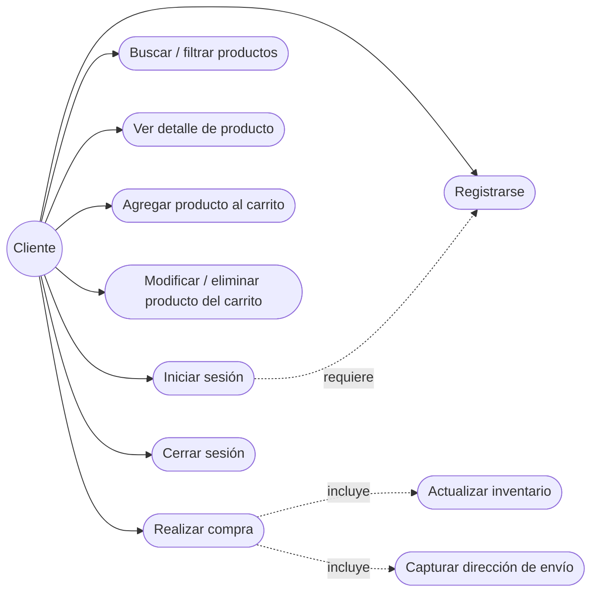
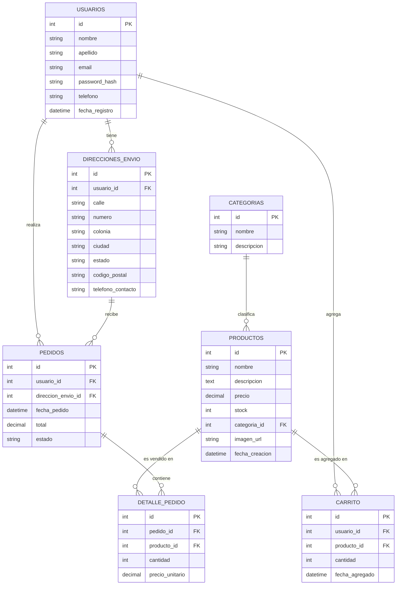
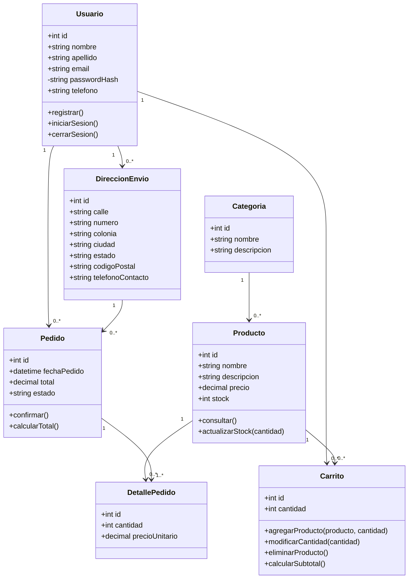
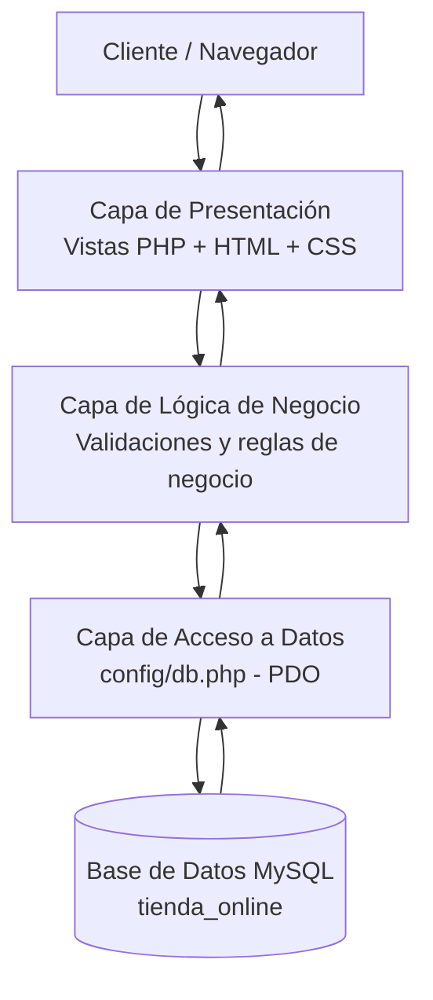
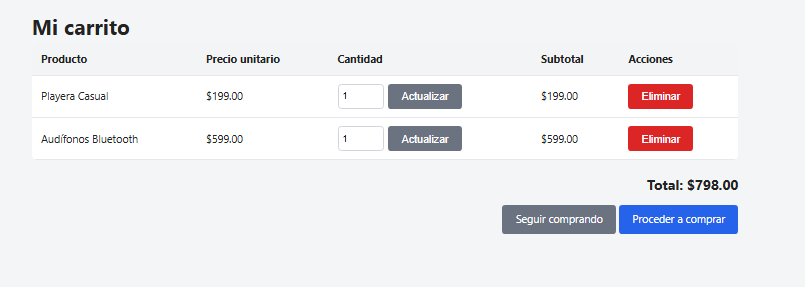
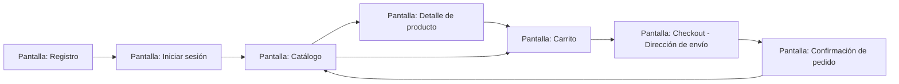
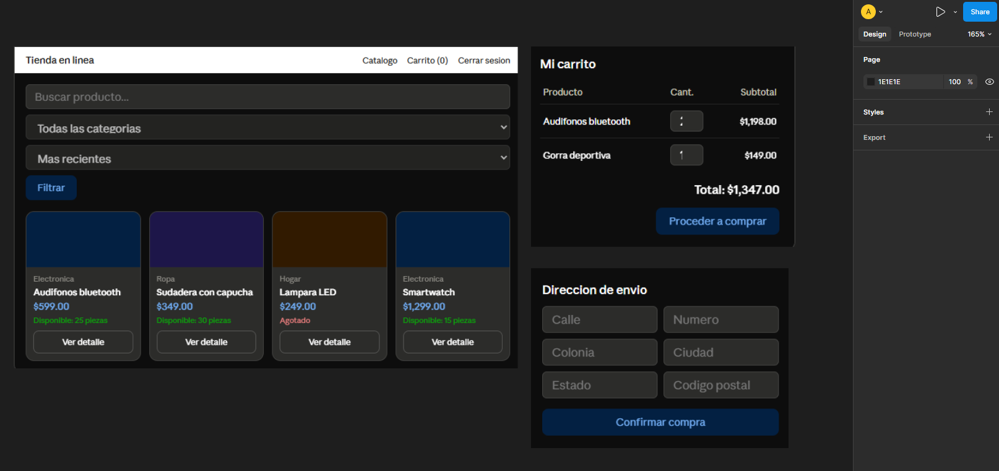
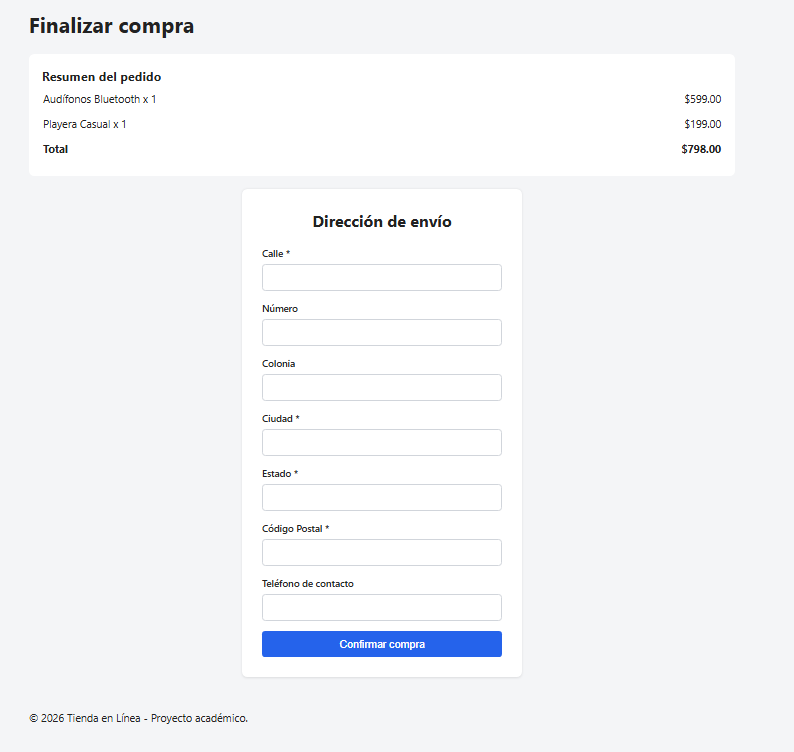

# Tienda en Línea

Sistema web de comercio electrónico que permite a los clientes registrarse, iniciar sesión, consultar el catálogo de productos, seleccionarlos de distintas formas, gestionar su carrito de compras y finalizar la compra capturando la información de pago y envío a domicilio. El inventario se actualiza automáticamente cada vez que se confirma una compra.

---

## Introducción

El comercio electrónico es hoy una de las formas más comunes de comprar y vender productos. Este proyecto académico tiene como objetivo diseñar e implementar una aplicación web de tienda en línea que cubra el flujo completo de un cliente: desde la creación de su cuenta hasta la confirmación de su compra, pasando por la consulta del catálogo, la selección de productos y el registro de los datos necesarios para el envío.

El documento presente describe el análisis, diseño e implementación del sistema, incluyendo sus requisitos, modelo de datos, arquitectura, prototipo de interfaz y las instrucciones necesarias para instalarlo y operarlo.

## Resumen del Sistema

La aplicación permite que un cliente:

- Cree una cuenta y inicie sesión de forma segura.
- Consulte el catálogo de productos, pudiendo buscarlos por nombre, filtrarlos por categoría y ordenarlos por nombre o precio.
- Visualice el detalle de un producto específico (descripción, precio y existencias).
- Agregue productos a su carrito de compras.
- Modifique la cantidad de un producto en su carrito o lo elimine antes de comprar.
- Capture su dirección de envío a domicilio y confirme su compra.
- Reciba una confirmación del pedido realizado.

Internamente, cada vez que se confirma una compra, el sistema descuenta automáticamente la cantidad comprada del inventario (stock) de cada producto, garantizando que la existencia mostrada en el catálogo siempre esté actualizada.

---

## Requisitos

### Funcionales y No Funcionales

**Requisitos Funcionales (RF)**

| Código | Descripción |
|---|---|
| RF01 | El sistema debe permitir el registro de nuevos usuarios (nombre, apellido, correo, contraseña, teléfono). |
| RF02 | El sistema debe permitir el inicio de sesión validando el correo y la contraseña contra la base de datos. |
| RF03 | El sistema debe permitir cerrar la sesión activa. |
| RF04 | El sistema debe mostrar el catálogo completo de productos disponibles. |
| RF05 | El sistema debe permitir buscar productos por nombre. |
| RF06 | El sistema debe permitir filtrar productos por categoría. |
| RF07 | El sistema debe permitir ordenar productos por nombre o por precio (ascendente/descendente). |
| RF08 | El sistema debe mostrar el detalle de un producto (descripción, precio, existencias). |
| RF09 | El sistema debe permitir agregar uno o varios productos al carrito de compras. |
| RF10 | El sistema debe permitir modificar la cantidad o eliminar productos previamente seleccionados en el carrito. |
| RF11 | El sistema debe capturar la información de envío a domicilio (calle, número, colonia, ciudad, estado, código postal, teléfono). |
| RF12 | El sistema debe registrar el pedido (compra) una vez confirmada la dirección de envío. |
| RF13 | El sistema debe actualizar automáticamente la existencia (stock) de cada producto comprado al confirmar el pedido. |
| RF14 | El sistema debe mostrar una confirmación del pedido con su número, total y estado. |

**Requisitos No Funcionales (RNF)**

| Código | Descripción |
|---|---|
| RNF01 | **Usabilidad:** la interfaz debe ser simple e intuitiva, permitiendo completar una compra en pocos pasos. |
| RNF02 | **Seguridad:** las contraseñas se almacenan con hash (`password_hash`/bcrypt) y todas las consultas a la base de datos usan sentencias preparadas (PDO) para prevenir inyección SQL. |
| RNF03 | **Disponibilidad:** el sistema debe funcionar correctamente en un servidor Apache/Nginx con soporte PHP 8 o superior. |
| RNF04 | **Rendimiento:** las consultas al catálogo deben responder en menos de 2 segundos bajo condiciones normales de uso. |
| RNF05 | **Escalabilidad:** la arquitectura en capas permite incorporar nuevos módulos (p. ej. pagos en línea) sin reescribir el sistema completo. |
| RNF06 | **Compatibilidad:** la interfaz debe visualizarse correctamente en navegadores de escritorio y dispositivos móviles. |
| RNF07 | **Mantenibilidad:** el código se organiza en archivos reutilizables (header, footer, conexión a BD) para facilitar su mantenimiento. |
| RNF08 | **Integridad de datos:** el registro del pedido, su detalle y la actualización del inventario se ejecutan dentro de una transacción SQL para garantizar consistencia. |

### Técnicos

- **Lenguaje backend:** PHP 8.x
- **Motor de base de datos:** MySQL / MariaDB
- **Acceso a datos:** PDO con sentencias preparadas
- **Frontend:** HTML5 y CSS3 (sin frameworks adicionales)
- **Servidor:** Apache (XAMPP / WAMP / MAMP) o servidor embebido de PHP
- **Control de versiones:** Git / GitHub
- **Navegador:** cualquier navegador moderno (Chrome, Firefox, Edge)

---

## Casos de Uso

### a. Diagramas

**Diagrama general de casos de uso**



### b. Descripción

| Caso de uso | Actor | Descripción | Precondición |
|---|---|---|---|
| Registrarse | Cliente | El cliente captura sus datos personales y crea una cuenta. | No tener cuenta previa con ese correo. |
| Iniciar sesión | Cliente | El cliente ingresa correo y contraseña para acceder al sistema. | Tener una cuenta registrada. |
| Buscar / filtrar productos | Cliente | El cliente consulta el catálogo usando texto de búsqueda, categoría u orden. | Ninguna. |
| Ver detalle de producto | Cliente | El cliente consulta la información completa de un producto. | El producto debe existir. |
| Agregar producto al carrito | Cliente | El cliente selecciona la cantidad deseada y la agrega a su carrito. | Sesión iniciada y stock disponible. |
| Modificar / eliminar producto del carrito | Cliente | El cliente cambia la cantidad de un producto en su carrito o lo retira. | Tener al menos un producto en el carrito. |
| Realizar compra | Cliente | El cliente captura su dirección de envío y confirma la compra. | Tener productos en el carrito. |
| Actualizar inventario | Sistema | Al confirmarse la compra, el sistema descuenta el stock vendido. | Compra confirmada. |
| Cerrar sesión | Cliente | El cliente termina su sesión activa. | Sesión iniciada. |

---

## Entidades, Atributos y Relaciones

**Cardinalidad de las relaciones**

| Entidad A | Relación | Entidad B | Cardinalidad |
|---|---|---|---|
| Usuario | tiene | Dirección de envío | 1 a N |
| Usuario | agrega productos a | Carrito | 1 a N |
| Usuario | realiza | Pedido | 1 a N |
| Categoría | clasifica | Producto | 1 a N |
| Producto | es agregado en | Carrito | 1 a N |
| Producto | es vendido en | Detalle de pedido | 1 a N |
| Pedido | contiene | Detalle de pedido | 1 a N |
| Dirección de envío | recibe | Pedido | 1 a N |

**Diagrama Entidad-Relación**



**Diagrama de Clases**



---

## Arquitectura del Sistema

**Tipo de arquitectura utilizada:** Arquitectura en capas (*Layered Architecture*), con una organización similar a MVC simplificado.

**Justificación:** se eligió una arquitectura en capas porque separa claramente las responsabilidades del sistema (presentación, lógica de negocio y acceso a datos), lo que facilita su mantenimiento y comprensión en un proyecto académico de este alcance. Además, PHP se adapta de forma natural a este modelo cuando no se requiere un framework completo, y permite escalar el proyecto en el futuro (por ejemplo, agregar una pasarela de pagos) sin afectar las demás capas.

**Componentes de la aplicación:**

1. **Capa de Presentación:** vistas en PHP/HTML/CSS (`index.php`, `login.php`, `register.php`, `cart.php`, `checkout.php`, etc.) encargadas de mostrar la información al cliente y capturar sus acciones.
2. **Capa de Lógica de Negocio:** validaciones y reglas del negocio incrustadas en cada script (verificación de stock, cálculo de totales, control de sesión, reglas de carrito y checkout).
3. **Capa de Acceso a Datos:** `config/db.php`, que centraliza la conexión PDO y todas las consultas preparadas hacia la base de datos.
4. **Capa de Persistencia:** base de datos MySQL `tienda_online`, donde se almacena la información de usuarios, productos, carrito y pedidos.



---

## Diseño de Interfaz (Prototipo)

Antes de programar la aplicación se elaboró un prototipo de las pantallas principales en **Figma**, con el fin de definir la distribución de los elementos, los formularios y el flujo de navegación. A partir de este prototipo se implementaron después las pantallas funcionales en HTML/CSS dentro de la propia aplicación.

**Prototipo — Login y Registro**


**Prototipo — Catálogo, Carrito y Checkout**



El flujo de navegación entre pantallas es el siguiente:



**Pantallas principales:**

- **Login / Registro:** formulario centrado con validación de campos y mensajes de error.
- **Catálogo:** barra superior con buscador, filtro por categoría y orden; cuadrícula de tarjetas de producto con precio y existencias.
- **Detalle de producto:** descripción completa, precio, existencias y selector de cantidad.
- **Carrito:** tabla editable con cantidad por producto, subtotales, total y botones para actualizar/eliminar.
- **Checkout:** resumen del pedido y formulario de dirección de envío.
- **Confirmación:** número de pedido, total y estado de la compra.

---

## Capturas del Sistema en Funcionamiento

A continuación se muestran capturas de la aplicación ya implementada y en ejecución, siguiendo el flujo completo del cliente.

**1. Registro de usuario**

El cliente captura sus datos personales para crear una cuenta.


**2. Confirmación de cuenta creada**

El sistema confirma que la cuenta se creó correctamente e invita a iniciar sesión.



**3. Sesión iniciada**

Una vez autenticado, la barra de navegación muestra el carrito, el saludo al usuario y la opción de cerrar sesión.


**4. Catálogo de productos**

El catálogo muestra los productos disponibles con su categoría, precio y existencias, además del buscador, el filtro por categoría y el ordenamiento.



**5. Carrito de compras**

El cliente puede revisar los productos seleccionados, actualizar la cantidad o eliminarlos, y ver el total antes de comprar.


**6. Finalizar compra (checkout)**

El sistema muestra el resumen del pedido y el formulario de dirección de envío para confirmar la compra.


---

## Estructura del Proyecto

```
tienda-online/
├── README.md
├── docs/
│   └── screenshots/            # Capturas de pantalla usadas en el README
├── database/
│   └── schema.sql              # Script de creación de la BD y datos de ejemplo
├── config/
│   └── db.php                  # Conexión PDO a la base de datos
├── includes/
│   ├── header.php              # Encabezado y barra de navegación
│   ├── footer.php               # Pie de página
│   └── auth_check.php          # Protección de páginas que requieren sesión
├── assets/
│   ├── css/
│   │   └── style.css           # Estilos de la aplicación
│   └── images/                 # Imágenes de productos (opcional)
├── index.php                   # Catálogo de productos (búsqueda/filtro/orden)
├── product.php                 # Detalle de un producto
├── register.php                # Registro de usuarios
├── login.php                   # Inicio de sesión
├── logout.php                  # Cierre de sesión
├── cart.php                    # Carrito de compras
├── cart_action.php             # Agregar/actualizar/eliminar productos del carrito
├── checkout.php                # Dirección de envío y confirmación de compra
└── order_confirmation.php      # Confirmación del pedido
```

---

## Instalación y Configuración

1. **Requisitos previos:** tener instalado [XAMPP](https://www.apachefriends.org/), WAMP o MAMP (incluyen PHP y MySQL).
2. **Clonar el repositorio:**
   ```bash
   git clone https://github.com/USUARIO/tienda-online.git
   ```
3. **Copiar el proyecto** a la carpeta pública del servidor (por ejemplo, `htdocs` en XAMPP).
4. **Crear la base de datos:** abrir phpMyAdmin (o el cliente MySQL de tu preferencia) y ejecutar el script `database/schema.sql`. Esto crea la base `tienda_online`, sus tablas y algunos productos de ejemplo.
5. **Configurar la conexión:** editar `config/db.php` y ajustar `$user` y `$pass` según tu instalación local de MySQL (por defecto XAMPP usa `root` sin contraseña).
6. **Iniciar el servidor:**
   - Con XAMPP/WAMP: iniciar Apache y MySQL desde el panel de control, y abrir `http://localhost/tienda-online/`.
   - O bien, usando el servidor embebido de PHP desde la carpeta del proyecto:
     ```bash
     php -S localhost:8000
     ```
     y abrir `http://localhost:8000/` en el navegador.

---

## Uso y Operación del Sistema

1. El cliente entra a la aplicación y, si no tiene cuenta, se registra desde **"Registrarse"**.
2. Inicia sesión con su correo y contraseña.
3. Consulta el catálogo, pudiendo buscar por nombre, filtrar por categoría u ordenar por precio/nombre.
4. Entra al detalle de un producto y selecciona la cantidad deseada para agregarlo al carrito.
5. Desde el carrito puede actualizar la cantidad de cualquier producto o eliminarlo antes de comprar.
6. Da clic en **"Proceder a comprar"**, captura su dirección de envío y confirma la compra.
7. El sistema valida nuevamente el stock, registra el pedido, descuenta automáticamente las existencias de cada producto comprado y vacía el carrito.
8. El cliente recibe una pantalla de confirmación con el número de pedido y el total pagado.

---

## Base de Datos (Modelado)

El modelo de datos se diseñó siguiendo el proceso de normalización hasta la Tercera Forma Normal (3FN), evitando redundancia de datos. Está compuesto por 7 tablas:

| Tabla | Propósito |
|---|---|
| `usuarios` | Almacena la información de las cuentas de los clientes. |
| `direcciones_envio` | Almacena las direcciones de envío capturadas por cada usuario. |
| `categorias` | Clasifica los productos del catálogo. |
| `productos` | Almacena el catálogo de productos junto con su existencia (stock). |
| `carrito` | Relaciona temporalmente a un usuario con los productos que ha seleccionado antes de comprar. |
| `pedidos` | Registra cada compra confirmada por un usuario. |
| `detalle_pedido` | Detalla los productos y cantidades que conforman cada pedido. |

El script completo de creación se encuentra en [`database/schema.sql`](database/schema.sql), e incluye las llaves primarias, llaves foráneas y restricciones de integridad (`ON DELETE CASCADE` / `ON DELETE SET NULL`) necesarias para mantener la consistencia entre tablas. La actualización del inventario y el registro del pedido se ejecutan dentro de una misma transacción SQL (`BEGIN` / `COMMIT` / `ROLLBACK`) para evitar inconsistencias si ocurre un error a mitad del proceso de compra.

---

## Conclusión

El desarrollo de este proyecto permitió aplicar de forma práctica el proceso completo de análisis, diseño e implementación de un sistema de software: desde la identificación de requisitos funcionales y no funcionales, hasta el modelado de la base de datos y la elección justificada de una arquitectura en capas. Trabajar con PHP y MySQL ayudó a reforzar conceptos clave como el uso de sentencias preparadas para prevenir inyección SQL, el manejo seguro de contraseñas mediante hash, y el uso de transacciones para mantener la integridad de los datos cuando varias tablas se modifican como parte de una misma operación (la compra).

Asimismo, diseñar el flujo de usuario —registro, inicio de sesión, exploración del catálogo, gestión del carrito y checkout— permitió entender mejor cómo se traduce un requisito de negocio en pantallas, validaciones y consultas concretas. Este proyecto sienta una base sólida que podría extenderse en el futuro con funcionalidades adicionales como pagos en línea, panel de administración de productos o notificaciones por correo electrónico.
